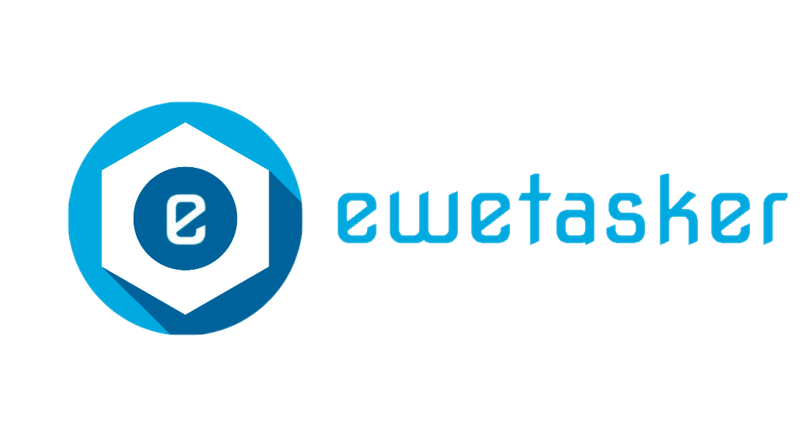
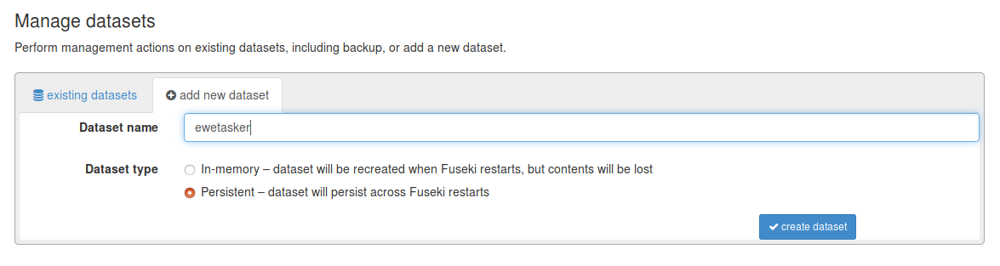
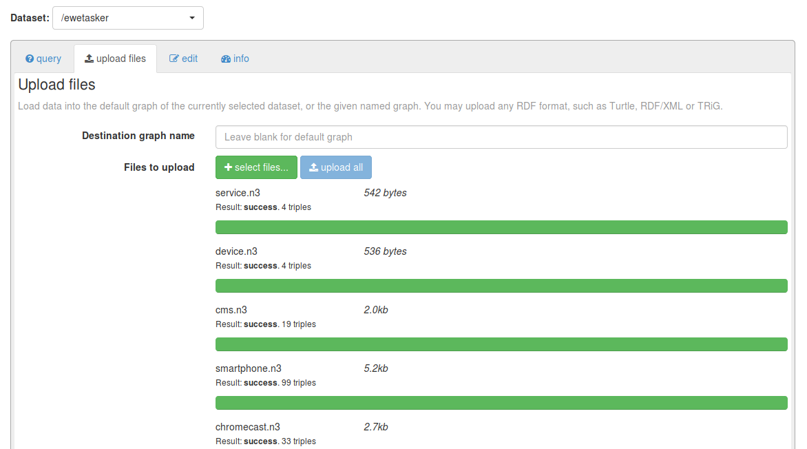

# EWE Tasker
EWE Tasker is an emotion aware automation platform based on semantic ECA (Event-Condition-Action) rules. It is capable of enable semantic automation rules in a smart environment allowing the user to configure his own automation rules in an easy way. This platform is divided in two modules: [Ewetasker Server](https://lab.cluster.gsi.dit.upm.es/ewe/ewetasker_server.git) module, and [Ewetasker Web Client](https://lab.cluster.gsi.dit.upm.es/ewe/ewetasker_webclient.git) module.

## EWE Tasker Server

This repository contains EWE Tasker Server module, written in Python. It provides an API REST to manage and evaluate semantic rules in order to automate tasks for services or smart devices.

## INSTALLATION

### REQUIREMENTS
In order to install Ewetasker server, it is needed to have installed docker-compose. Follow this [link](https://docs.docker.com/compose/install/) if you need more information about it.

### STEP BY STEP

First of all, clone the git project locally and access to Ewetasker server directory.

```
$ git clone https://lab.cluster.gsi.dit.upm.es/ewe/ewetasker_server.git ewetasker_server
```

To continue, go to /etc folder in your computer path and change your configuration to enable enough memory to use Elasticsearch:

```
$ cd etc
$ sudo chmod 666 sysctl.conf
$ sudo sed -i -e '$a\ vm.max_map_count=262144' sysctl.conf
$ sudo sysctl -p
```

Once made it, go back to /ewetasker_server and launch docker-compose.

```
$ docker-compose up --build
```

When build process finishes, access to Fuseki service in localhost:3030 to upload the .n3 files. Fuseki credentials are "admin" and "ewefuseki".

Click on "manage datasets" and then "add new dataset". You must name the dataset as "ewetasker", and choose "persistent" option.



Then, click on "upload data" and select .n3 files contained in "vocabularies" folder. To finish click on "upload all".



Once finished this, stop docker-compose and launch it again in order to start crossbar container successfully.

```
$ docker-compose down
$ docker-compose up
```

At this point, you can test your installation by making a GET Request to localhost:5050.

```
curl -i -H "Accept: application/json" -H "Content-Type: application/json" -X GET http://localhost:5050/channels/base
```

The response must be like this:

```
{"@context": {"@vocab": "http://www.gsi.dit.upm.es/ontologies/ewe#"}, "channels": [{"@id": "http://gsi.dit.upm.es/ontologies/ewe/ns/Chromecast", "rdfs:label": "Chromecast", "rdfs:comment": "This channel represents a chromecast device with simple capabilities.", "foaf:logo": "fa fa-chrome", "color": "#ea4335", "events": [], "actions": [{"@id": "http://gsi.dit.upm.es/ontologies/ewe/ns/PlayVideoChromecast", "rdfs:label": "Play video", "rdfs:comment": "This action will play a video on Chromecast.", "input_parameters": [{"@id": "http://gsi.dit.upm.es/ontologies/ewe/ns/ChromecastLocalIP", "rdfs:label": "Chromecast Local IP", "rdfs:comment": "This parameter represents the local IP of the Chromecast.", "rdf:datatype": "http://www.w3.org/2001/XMLSchema#string"}, {"@id": "http://gsi.dit.upm.es/ontologies/ewe/ns/ChromecastPublicIP", "rdfs:label": "Chromecast Public IP", "rdfs:comment": "This parameter represents the public IP of the Chromecast.", "rdf:datatype": "http://www.w3.org/2001/XMLSchema#string"}], "output_parameters": [{"@id": "http://gsi.dit.upm.es/ontologies/ewe/ns/ChromecastVideoUrl", "rdfs:label": "Youtube video url", "rdfs:comment": "This parameter represents the youtube video url to be reproduced.", "rdf:datatype": "http://www.w3.org/2001/XMLSchema#string"}]}], "parameters": [{"@id": "http://gsi.dit.upm.es/ontologies/ewe/ns/ChromecastLocalIP", "rdfs:label": "Chromecast Local IP", "rdfs:comment": "This parameter represents the local IP of the Chromecast.", "rdf:datatype": "http://www.w3.org/2001/XMLSchema#string"}, {"@id": "http://gsi.dit.upm.es/ontologies/ewe/ns/ChromecastPublicIP", "rdfs:label": "Chromecast Public IP", "rdfs:comment": "This parameter represents the public IP of the Chromecast.", "rdf:datatype": "http://www.w3.org/2001/XMLSchema#string"}]}, ...
```

In order to interact with Ewetasker server in a simple way, you can install Ewetasker web application in this [link](https://lab.cluster.gsi.dit.upm.es/ewe/ewetasker_webclient).

## API CALLS

| Route | Method | Description |
|---|---|---|
| /channels/base  | GET  | Get a list of base channels available at the platform  |
| /channels/category/{categoryUri}  | GET  | Get a list by category (Services or Devices) of channels available at the platform  |
| /channels/custom  | GET  | Get a list of custom channels available at the platform  |
| /channels/custom/category/{categoryUri}  | GET  | Get a list by category (Services or Devices) of custom channels available at the platform  |
| /channels/import  | POST  | Import a new custom channel from a json |
| /channels/custom/delete/{customChannelUri}  | DELETE  | Delete a custom channel |
| /rules/new | POST  | Create a new rule from a json|
| /rules/user/{userUri}  | GET  | Get a list of rules available at the platform for the specified user |
| /rules/delete/{ruleUri}  | DELETE  | Delete a custom channel |
| /users/new | POST  | Create a new user|
| /users/login | POST  | Login at platform|
| /users/delete  | DELETE  | Delete a user |
| /evaluate  | POST  | Evaluate an event |

## Get Channels

```
[
   {
      "@id":"http://gsi.dit.upm.es/ontologies/ewe-connected-home-smarttv/ns/SmartTv",
      "rdfs:label":"\"Connected door-lock\"@en",
      "rdfs:comment":"\"This channel represents a simplified smarttv with simple capabilities\"",
      "events":[

      ],
      "actions":[
         {
            "@id":"http://gsi.dit.upm.es/ontologies/ewe-connected-home-smarttv/ns/SwitchOn",
            "rdfs:label":"\"Switch on\"@en",
            "rdfs:comment":"\"This action will switch on the TV.\"@en",
            "input_parameters":[
               {
                  "@id":"http://gsi.dit.upm.es/ontologies/ewe-connected-home-smarttv/ns/LocalIP",
                  "rdfs:label":"\"Local IP\"@en",
                  "rdfs:comment":"\"This parameter represents the local IP of the TV.\"@en"
               },
               {
                  "@id":"http://gsi.dit.upm.es/ontologies/ewe-connected-home-smarttv/ns/PublicIP",
                  "rdfs:label":"\"Public IP\"@en",
                  "rdfs:comment":"\"This parameter represents the public IP of the TV.\"@en"
               }
            ],
            "output_parameters":[

            ]
         },
         {
            "@id":"http://gsi.dit.upm.es/ontologies/ewe-connected-home-smarttv/ns/SwitchOff",
            "rdfs:label":"\"Switch off\"@en",
            "rdfs:comment":"\"This action will switch off the TV.\"@en",
            "input_parameters":[
               {
                  "@id":"http://gsi.dit.upm.es/ontologies/ewe-connected-home-smarttv/ns/LocalIP",
                  "rdfs:label":"\"Local IP\"@en",
                  "rdfs:comment":"\"This parameter represents the local IP of the TV.\"@en"
               },
               {
                  "@id":"http://gsi.dit.upm.es/ontologies/ewe-connected-home-smarttv/ns/PublicIP",
                  "rdfs:label":"\"Public IP\"@en",
                  "rdfs:comment":"\"This parameter represents the public IP of the TV.\"@en"
               }
            ],
            "output_parameters":[

            ]
         },
         {
            "@id":"http://gsi.dit.upm.es/ontologies/ewe-connected-home-smarttv/ns/DisplayImage",
            "rdfs:label":"\"Display image\"@en",
            "rdfs:comment":"\"This action will display an image on the screen.\"@en",
            "input_parameters":[
               {
                  "@id":"http://gsi.dit.upm.es/ontologies/ewe-connected-home-smarttv/ns/LocalIP",
                  "rdfs:label":"\"Local IP\"@en",
                  "rdfs:comment":"\"This parameter represents the local IP of the TV.\"@en"
               },
               {
                  "@id":"http://gsi.dit.upm.es/ontologies/ewe-connected-home-smarttv/ns/PublicIP",
                  "rdfs:label":"\"Public IP\"@en",
                  "rdfs:comment":"\"This parameter represents the public IP of the TV.\"@en"
               }
            ],
            "output_parameters":[

            ]
         }
      ],
      "parameters":[
         {
            "@id":"http://gsi.dit.upm.es/ontologies/ewe-connected-home-smarttv/ns/LocalIP",
            "rdfs:label":"\"Local IP\"@en",
            "rdfs:comment":"\"This parameter represents the local IP of the TV.\"@en"
         },
         {
            "@id":"http://gsi.dit.upm.es/ontologies/ewe-connected-home-smarttv/ns/PublicIP",
            "rdfs:label":"\"Public IP\"@en",
            "rdfs:comment":"\"This parameter represents the public IP of the TV.\"@en"
         }
      ]
   }
]
```

# License
   Copyright 2018 Sergio Muñoz López and Carlos A. Iglesias Fernández.

   Licensed under the Apache License, Version 2.0 (the "License");
   you may not use this file except in compliance with the License.
   You may obtain a copy of the License at

       http://www.apache.org/licenses/LICENSE-2.0

   Unless required by applicable law or agreed to in writing, software
   distributed under the License is distributed on an "AS IS" BASIS,
   WITHOUT WARRANTIES OR CONDITIONS OF ANY KIND, either express or implied.
   See the License for the specific language governing permissions and
   limitations under the License.